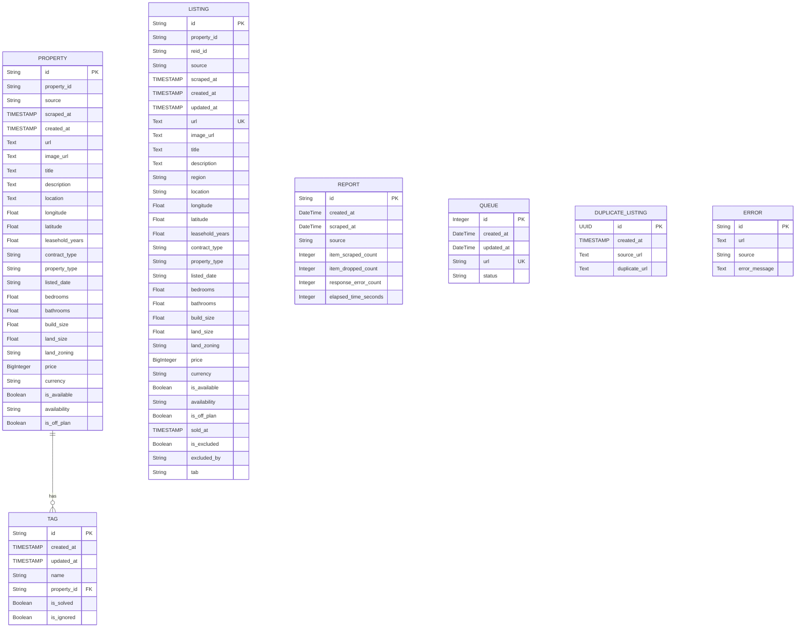

# Development

This section covers how to set up a local development environment, understand the code structure, run spiders, handle DB migrations, and contribute to the project.

## Prerequisites

- Python 3.8+
- Git
- (Optional) virtualenv

## Setup

```bash
# 1. Clone & enter repo
git clone https://github.com/ekkyarmandi/reid && cd reid

# 2. Create & activate venv
python3 -m venv .venv
source .venv/bin/activate

# 3. Install dependencies
pip install -r requirements.txt
```

## Project Structure

```
.
├─ reid/ # Scrapy project
│ ├─ spiders/ # Spider definitions
│ ├─ items.py # Data models (PropertyItem, etc.)
│ ├─ pipelines/ # Data processing pipelines
│ ├─ models/ # SQLAlchemy models
│ └─ settings.py
├─ documents/ # MkDocs site
│ ├─ mkdocs.yml
│ └─ docs/
│    ├─ index.md
│    ├─ how-it-work.md
│    ├─ how-to-use.md
│    └─ development.md
├─ migrations/ # Alembic migrations
└─ scrapy.cfg
```

## Tables



## Database Migrations

```bash
# Create a new migration
alembic revision --autogenerate -m "describe change"

# Apply all pending migrations
alembic upgrade head

# Roll back (if needed)
alembic downgrade <revision_id>
```

## Running Spiders

```bash
# List available spiders
scrapy list

# Run a spider
scrapy crawl <spider_name>
```
