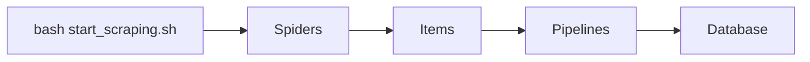
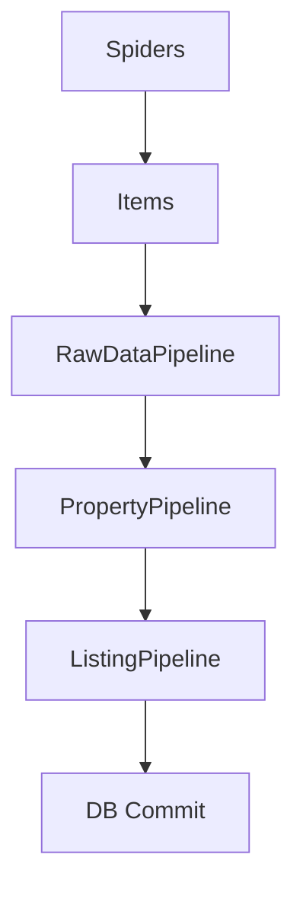

# How It Works

This document explains the internal workflow of the scraping process. It covers what happens when you run `bash start_scraping.sh` or execute individual spiders.



## Running the scrapers

When you run:

```bash
bash start_scraping.sh
```

each configured Scrapy spider is executed in sequence. For example:

```
scrapy crawl ubudproperty
scrapy crawl unrealbali
```

Use `scrapy list` to see all available spiders.

## Spiders

Spiders locate and navigate to target web pages, sending HTTP requests and parsing responses. Each spider:

- Defines start URLs and parsing rules.
- Extracts raw HTML and metadata.
- Uses `ItemLoader` to populate `PropertyItem` with fields like `property_id`, `title`, `location`, `price`, etc.

## Items

`PropertyItem` defines the data schema for scraped properties. It includes:

- Raw data fields (e.g., `source`, `url`, `html`).
- Structured property fields (e.g., `property_id`, `title`, `location`, `price`).
- Field processors to clean and format data.



## Pipelines

Items pass through the configured pipelines in `reid/settings.py`:

- **RawDataPipeline**

  - Stores raw HTML and JSON in the `RawData` model.
  - Records crawl statistics and errors in the `Report` model.

- **PropertyPipeline**

  - Transforms item data to match the `Property` model.
  - Assigns land zoning and validates fields.
  - On error, logs details in the `Error` model and rolls back the transaction.

- **ListingPipeline**
  - Inserts or updates `Listing` records based on property changes.
  - Compares incoming data with existing records and applies updates.

Enable pipelines by editing the `ITEM_PIPELINES` setting:

```python
ITEM_PIPELINES = {
    'reid.pipelines.raw.RawDataPipeline': 100,
    'reid.pipelines.property.PropertyPipeline': 200,
    'reid.pipelines.listing.ListingPipeline': 300,
}
```

## Database

The project uses SQLAlchemy models:

- `RawData`: Raw HTML/JSON storage.
- `Property`: Parsed property details.
- `Listing`: Listing snapshots and history.
- `Error`: Scraping or processing errors.
- `Report`: Crawl statistics per spider run.

Pipelines commit data to the database via SQLAlchemy sessions. See [Development](development.md) for more details about the database models.
